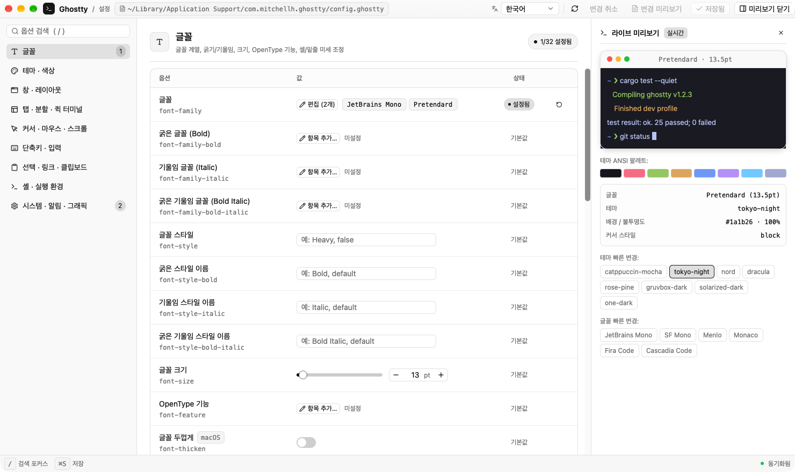

# ghostty-setting

A desktop settings editor for [Ghostty](https://ghostty.org) — all 200 configuration
options, grouped into nine categories, with a live terminal preview beside the list.



## What it does

- **Every documented option.** The schema carries all 200 keys with their valid
  values, so an option is editable whether or not it is already in your file.
- **Edits your file, not a copy of it.** Values are written back into the existing
  lines, so comments, blank lines, ordering and your own spacing survive. Repeatable
  keys (`font-family`, `env`, `keybind`, `palette`, …) keep every occurrence.
- **Live preview.** Font, size, theme, background, foreground, cursor style and the
  16-colour palette are drawn as you change them, before you save.
- **Bilingual.** Korean and English, switched from the title bar. Option labels,
  hints and documentation are translated; a search matches either language.
- **Worth reading before you trust it.** Every option row links to its own anchor on
  Ghostty's [configuration reference](https://ghostty.org/docs/config/reference).

## Install

```sh
# install
curl -fsSL https://raw.githubusercontent.com/allbegray/ghostty-setting/main/install.sh | sh

# remove
curl -fsSL https://raw.githubusercontent.com/allbegray/ghostty-setting/main/install.sh | sh -s -- --uninstall
```

Install takes the prebuilt binary for your Mac from the latest release and puts it
in `~/.local/bin`; if there is no prebuilt binary for your machine it builds from
source with cargo instead, so Rust is only needed in that case. Remove takes back
whichever of the two it created — the binary only, never your Ghostty
configuration.

With Rust installed, either path works on its own:

```sh
cargo install --git https://github.com/allbegray/ghostty-setting --locked
cargo uninstall ghostty-setting
```

## Build and run

From a checkout, with a recent stable Rust toolchain:

```sh
cargo run                       # opens the config this machine would use
cargo run -- ~/.config/ghostty/config   # or a file you name
```

The config file is chosen the way Ghostty chooses it: `config.ghostty` before
`config`, macOS Application Support before XDG.

```sh
cargo test
```

## Layout

```
src/
  main.rs            window, keybindings, asset registration
  i18n.rs            Lang + Text: bilingual copy resolved while rendering
  app/
    mod.rs           the view: state, the one commit path, the frame shell
    chrome.rs        title bar, sidebar, option table, status bar
    editor.rs        the control each option kind needs
    editors.rs       retained per-row editor cache and its eviction rule
    value.rs         stored string ⇄ bool / index / colour / flags
    list_editor.rs   the modal that edits repeatable keys
    preview.rs       live preview panel and the model behind it
    query.rs         which options are visible, how many are set, is it dirty
  config/
    schema.rs        200 options, 9 categories, bilingual labels and docs
    linefile.rs      line-preserving read / set / remove
    mod.rs           config path discovery
```

## Notes

- The configuration model is deliberately conservative: it never rewrites a line it
  did not have to change.
- `Kind` carries the valid range for numeric options; the UI narrows some of them
  for editing, and a test keeps every narrowing inside the valid range.
- Status: early. The window is laid out for macOS; Linux and GTK options are
  editable but untested.
